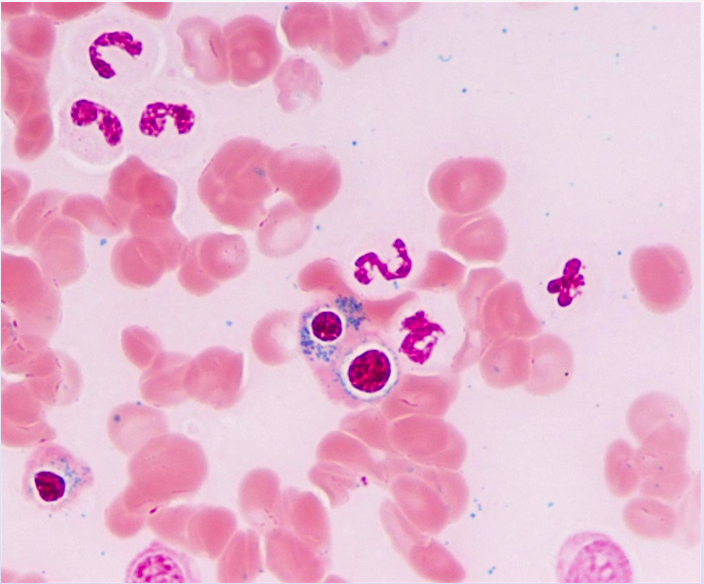

# Gastrointestinal & Nutrition — Organ Systems
## Topic: Biliary tract disorders
## Clinical Case
A 45-year-old obese woman presents to the emergency department with severe right upper quadrant pain that started 6 hours ago. The pain is constant, radiates to the right shoulder, and is associated with nausea and vomiting. She reports similar episodes in the past that resolved spontaneously. Tahir 123

**Physical Examination:**
- **Temperature:** 38.5°C (101.3°F)
- **Blood pressure:** 130/85 mm Hg
- **Heart rate:** 100/min
- **Abdominal examination:** Tenderness in the right upper quadrant with positive Murphy's sign
- **Laboratory studies:** 
  - WBC: 12,000/μL (elevated)
  - Total bilirubin: 1.2 mg/dL (slightly elevated)
  - ALT: 45 U/L (normal)
  - AST: 50 U/L (normal)

Ultrasound of the abdomen shows gallstones, gallbladder wall thickening, and pericholecystic fluid.

---

## Question
What is the most appropriate next step in management?

**A.** Observation and pain management

### Choice A Explanation — Observation and pain management
**Why it's wrong:** While pain management is important, acute cholecystitis requires definitive treatment. Observation alone risks complications such as gangrenous cholecystitis, perforation, or sepsis.

**B.** Endoscopic retrograde cholangiopancreatography (ERCP)

### Choice B Explanation — ERCP
**Why it's wrong:** ERCP is used for common bile duct stones, not for gallbladder disease. This patient's pathology is in the gallbladder, not the bile ducts.

**C.** Percutaneous cholecystostomy

### Choice C Explanation — Percutaneous cholecystostomy
**Why it's wrong:** This is a temporary measure used in patients who are too ill for surgery or as a bridge to cholecystectomy. For a healthy 45-year-old, cholecystectomy is the appropriate treatment.

**D.** Cholecystectomy (surgical removal of gallbladder) ✅

### Choice D Explanation — Cholecystectomy
**Why it's correct:**
- **Definitive treatment:** Removes the source of the problem (inflamed gallbladder with stones)
- **Prevents recurrence:** Eliminates future episodes of cholecystitis
- **Standard of care:** Laparoscopic cholecystectomy is the gold standard for acute cholecystitis
- **Timing:** Early cholecystectomy (within 72 hours) is preferred over delayed surgery
- **Low risk:** In a healthy patient, the procedure has low morbidity and mortality

**E.** Oral ursodeoxycholic acid

### Choice E Explanation — Ursodeoxycholic acid
**Why it's wrong:** This medication is used to dissolve small cholesterol stones in asymptomatic patients, not for acute cholecystitis. It is not effective for acute inflammation and does not address the immediate problem.

**Correct Answer:** D

---

## Explanation

### Overview
This patient has **acute cholecystitis**, an inflammation of the gallbladder typically caused by obstruction of the cystic duct by gallstones. The clinical triad of right upper quadrant pain, fever, and leukocytosis, combined with ultrasound findings (gallstones, wall thickening, pericholecystic fluid), confirms the diagnosis. **Cholecystectomy** is the definitive treatment.

---

### Clinical Presentation
- **Right upper quadrant pain:** Classic location for gallbladder disease
- **Murphy's sign:** Positive (pain on inspiration during palpation of RUQ) - highly specific for cholecystitis
- **Fever and leukocytosis:** Indicate inflammation/infection
- **Radiating pain to right shoulder:** Referred pain via phrenic nerve (C3-C5 dermatomes)
- **Ultrasound findings:** Gallstones, wall thickening (>4mm), and pericholecystic fluid are diagnostic

---

### Diagnostic Criteria

| Finding            | Present | Significance |
|--------------------|---------|-------------|
| RUQ pain           | Yes | Classic location |
| Fever | Yes (38.5°C) | Indicates inflammation |
| Leukocytosis | Yes (12,000) | Inflammatory response |
| Murphy's sign | Positive | Highly specific |
| Ultrasound findings | Yes | Diagnostic |

---

## Choice-by-Choice Explanations

## Management Approach
1. **Immediate:**
   - NPO (nothing by mouth)
   - IV fluids
   - Pain management (morphine or NSAIDs)
   - Antibiotics (covering gram-negative and anaerobes)

2. **Definitive treatment:**
   - **Laparoscopic cholecystectomy** within 72 hours of symptom onset
   - Alternative: Open cholecystectomy if laparoscopic is not feasible

3. **Postoperative:**
   - Monitor for complications (bile leak, infection)
   - Most patients can resume normal diet within 24-48 hours

---

*End of test question 3.*

