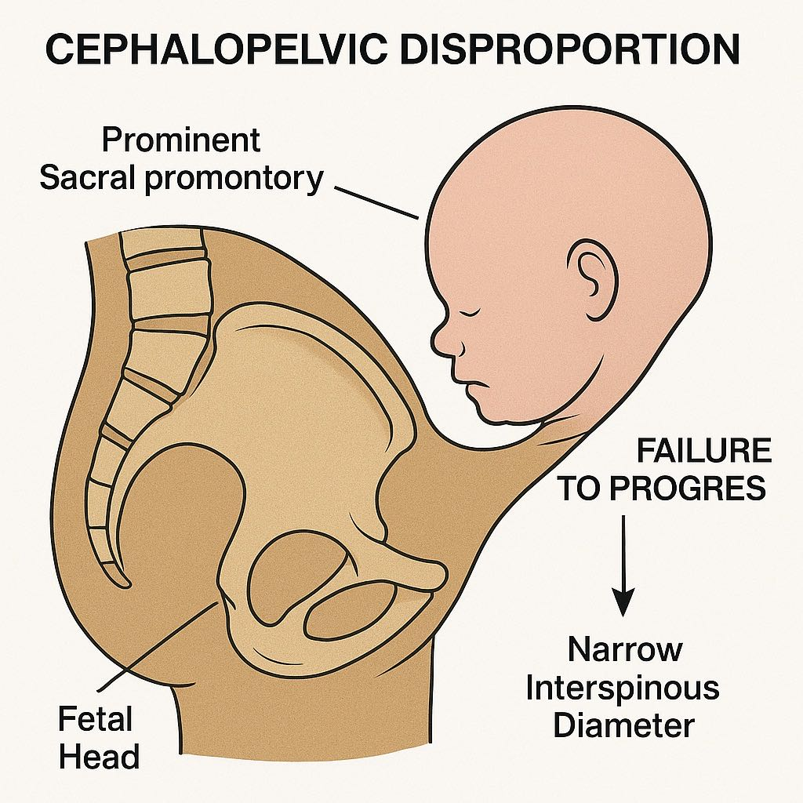

Your Application Tracking ID is: 11792057
k

---
title: "Obstetrics & Gynecology (Pelvic Anatomy) — Reproductive System – Nerve Supply"
tags: [Obstetrics & Gynecology]
difficulty: medium
correct_answer: B
question_id: 714025
---

# Obstetrics & Gynecology (Pelvic Anatomy) — Reproductive System – Nerve Supply
## Topic: Anatomy – Pelvic Nerve Landmarks and Nerve Blocks

## Question
A primigravida in active labor requests pain relief. A pudendal nerve block is planned. The needle should be inserted near which landmark?

**A.** Pubic symphysis

### Choice A Explanation — Pubic symphysis
Not related to pudendal nerve.
This midline structure is an anterior bony landmark, associated more with bladder and pelvic bone anatomy.
It is not close to the course of the pudendal nerve.

**B.** Ischial spine ✅

### Choice B Explanation — Ischial spine
**Correct landmark for pudendal nerve block.**
The pudendal nerve passes posterior to the ischial spine and medial to the sacrospinous ligament.
During a transvaginal pudendal nerve block, the ischial spine is palpated through the vaginal wall as a bony prominence.
A needle is inserted near the ischial spine to deliver local anesthetic around the pudendal nerve, providing pain relief in the perineum and lower vagina during late labor or episiotomy.

**C.** Sacral promontory

### Choice C Explanation — Sacral promontory
Too high and posterior.
The sacral promontory marks the border between the lumbar spine and sacrum, and is part of the pelvic inlet.
It is not near the ischial spine or pudendal nerve, and thus not used for a pudendal block.

**D.** Iliac crest

### Choice D Explanation — Iliac crest
Lateral and superior landmark.
The iliac crest is the uppermost edge of the ilium, used for lumbar puncture (L4 level) identification.
It is not near the pelvic outlet or pudendal nerve.

**E.** Greater sciatic foramen

### Choice E Explanation — Greater sciatic foramen
Incorrect approach site.
While the pudendal nerve exits the pelvis through the greater sciatic foramen, the block is not performed here.
It re-enters via the lesser sciatic foramen and becomes accessible near the ischial spine, which is the correct landmark.

**Correct Answer:** B

---

## Explanation

#### Key Concept

Pudendal nerve block is performed transvaginally by palpating the ischial spine, where the pudendal nerve lies close to the sacrospinous ligament. This provides anesthesia to the perineum, vulva, and lower vagina — crucial for instrumental deliveries or episiotomy.

#### Anatomy – Pelvic Nerve Landmarks and Nerve Blocks

| Nerve / Block             | Key Landmark(s)                                                  | Clinical Use / Relevance                                          |
| ------------------------- | ---------------------------------------------------------------- | ----------------------------------------------------------------- |
| Pudendal Nerve Block      | Ischial spine, sacrospinous ligament                             | Perineal anesthesia during labor, episiotomy, or forceps delivery |
| Ilioinguinal Nerve Block  | 2 cm medial and superior to anterior superior iliac spine (ASIS) | Anesthesia for inguinal hernia repair, scrotal/labial surgery     |
| Genitofemoral Nerve Block | Over inguinal ligament near femoral artery                       | Pain control in upper anterior scrotum/labia majora               |
| Caudal Epidural Block     | Sacral hiatus between sacral cornua (S4–S5)                      | Pediatric surgeries and labor analgesia (less common now)         |
| Lumbar Plexus Block       | Psoas compartment (near L3 vertebra)                             | Anesthesia for hip/knee surgeries; rarely used in obstetrics      |
| Sciatic Nerve Block       | Midpoint between greater trochanter and ischial tuberosity       | Anesthesia of posterior thigh and most of lower leg               |
| Obturator Nerve Block     | Obturator foramen (deep to adductor muscles)                     | Bladder surgery, spastic adduction of thigh, TURBT procedures     |

**Summary Point:**
Pudendal nerve block is the most important for obstetric perineal anesthesia, and the ischial spine is the consistent landmark for accurate nerve localization.

