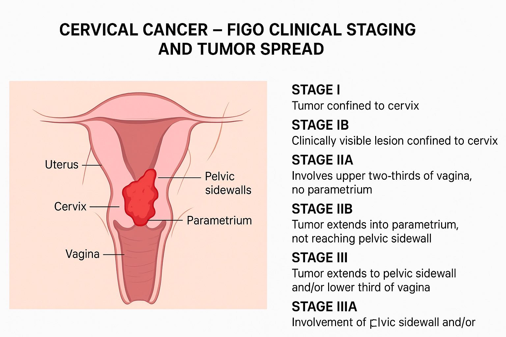

# Obstetrics & Gynecology (Physiology) — Female Reproductive System - Endocrine System + Pregnancy-related Metabolic Physiology
## Topic: Physiology – Endocrine Adaptations in Pregnancy

## Question
A 28-year-old pregnant woman in her 24th week develops rising postprandial glucose levels despite no prior history of diabetes. Lab testing shows increased human placental lactogen (hPL). What is the most likely physiological role of hPL contributing to this finding?

**A.** Enhances maternal thyroid activity

### Choice A Explanation — Enhances maternal thyroid activity
This is incorrect. While pregnancy does increase thyroid gland activity, this is primarily driven by human chorionic gonadotropin (hCG), which has a similar structure to thyroid-stimulating hormone (TSH) and can weakly stimulate the thyroid.
hPL does not have a significant role in enhancing maternal thyroid activity.

**B.** Promotes fetal surfactant production

### Choice B Explanation — Promotes fetal surfactant production
This is incorrect. The production of fetal surfactant, which is crucial for lung maturation, is primarily stimulated by fetal cortisol.
While hPL has some metabolic effects, it is not the main hormone responsible for the direct promotion of surfactant production.

**C.** Increases maternal insulin resistance to supply glucose to fetus ✅

### Choice C Explanation — Increases maternal insulin resistance to supply glucose to fetus
Human placental lactogen (hPL) is a hormone produced by the syncytiotrophoblast of the placenta. Its primary function is to alter maternal metabolism to ensure a continuous supply of glucose and amino acids to the developing fetus.
It achieves this by acting as an antagonist to insulin. This causes the mother's cells to become less sensitive to insulin, leading to maternal insulin resistance.
As a result, glucose remains in the bloodstream longer after meals, making more available for placental transfer and fetal uptake.
This physiological change, while beneficial for the fetus, can lead to elevated maternal blood glucose levels, particularly after eating, and is the underlying mechanism for gestational diabetes.

**D.** Inhibits uterine contractility in the third trimester

### Choice D Explanation — Inhibits uterine contractility in the third trimester
This is incorrect. Uterine contractility is primarily inhibited by progesterone, which maintains uterine quiescence throughout most of the pregnancy.
hPL does not have a significant role in inhibiting uterine contractions.

**E.** Suppresses fetal cortisol synthesis

### Choice E Explanation — Suppresses fetal cortisol synthesis
This is incorrect. Fetal cortisol is essential for the maturation of many fetal organs, including the lungs, and its synthesis is regulated by the fetal hypothalamic-pituitary-adrenal axis.
hPL does not suppress fetal cortisol synthesis; in fact, the two hormones have distinct and largely unrelated physiological roles.

**Correct Answer:** C

---

## Explanation

#### Key Concepts

- **Human Placental Lactogen (hPL):** A hormone produced by the placenta that acts as an insulin antagonist, increasing maternal insulin resistance to ensure adequate glucose supply for the fetus.
- **Gestational Diabetes:** A condition of impaired glucose tolerance that develops during pregnancy, often due to the insulin-antagonistic effects of hPL and other placental hormones.
- **Insulin Resistance:** A state where the body's cells don't respond effectively to insulin, leading to higher blood glucose levels. This is a normal physiological adaptation in pregnancy, but can become pathological.

#### Physiology – Endocrine Adaptations in Pregnancy

| Hormone                                | Source                               | Physiological Role in Pregnancy                                                                            |
| -------------------------------------- | ------------------------------------ | ---------------------------------------------------------------------------------------------------------- |
| **hPL (Human Placental Lactogen)**     | Syncytiotrophoblast of placenta      | • Increases maternal insulin resistance • Promotes lipolysis • Ensures glucose availability to fetus |
| **hCG (Human Chorionic Gonadotropin)** | Syncytiotrophoblast of placenta      | • Maintains corpus luteum to produce progesterone in early pregnancy • Mimics TSH → ↑ thyroid hormones  |
| **Progesterone**                       | Corpus luteum (early), then placenta | • Maintains uterine quiescence • Supports endometrium • Inhibits lactation until delivery            |
| **Estrogen**                           | Placenta                             | • Promotes uterine growth • Breast development • Increases uteroplacental blood flow                 |
| **Prolactin**                          | Maternal anterior pituitary          | • Stimulates breast tissue for lactation • Modulates maternal metabolism                                |
| **Cortisol (↑ due to CRH)**            | Maternal adrenal + placental CRH     | • Aids in fetal organ maturation • Contributes to maternal hyperglycemia in late pregnancy              |

**Summary Key Point:**
Pregnancy involves complex endocrine adaptations—especially from placenta-derived hormones—that prioritize fetal growth by altering maternal metabolism, particularly glucose and fat metabolism.

