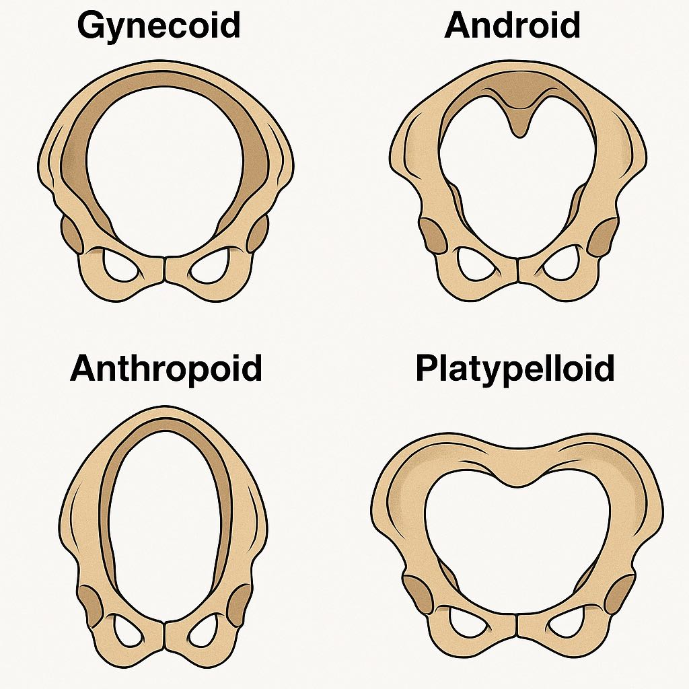
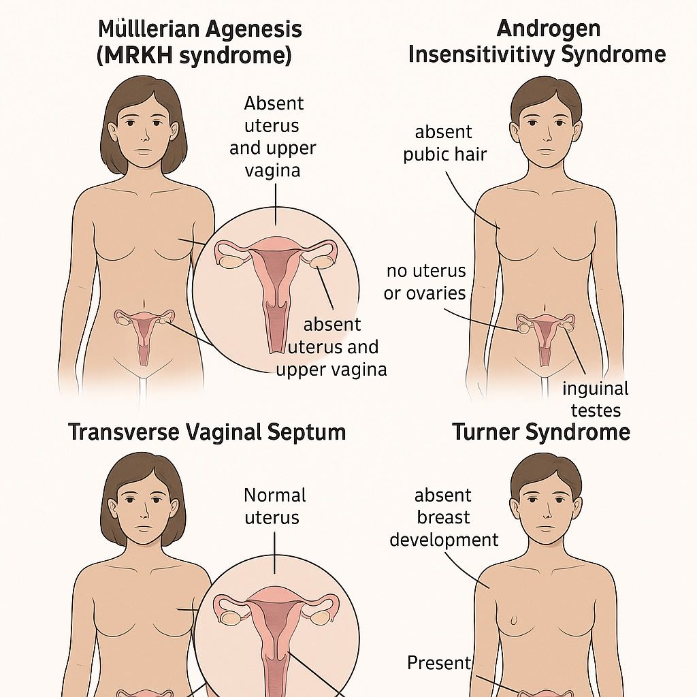
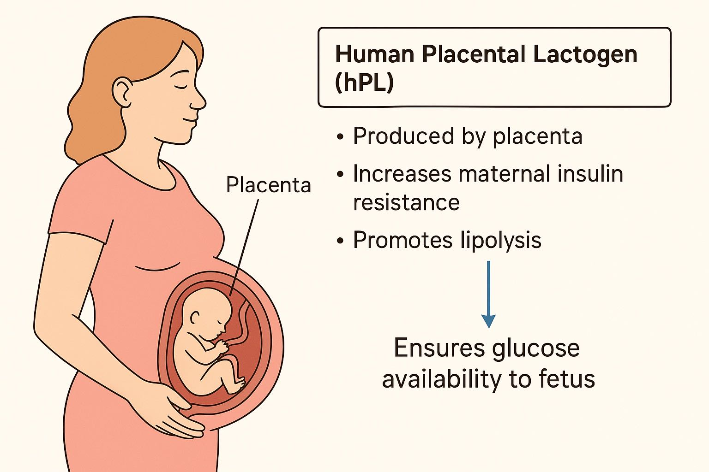
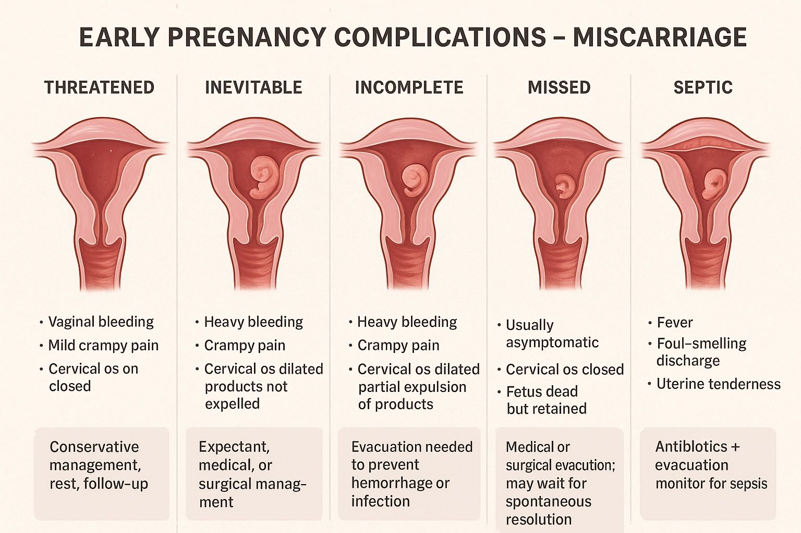
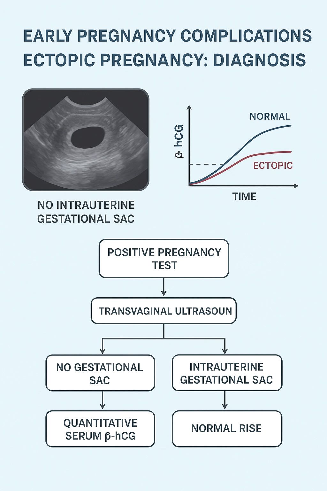
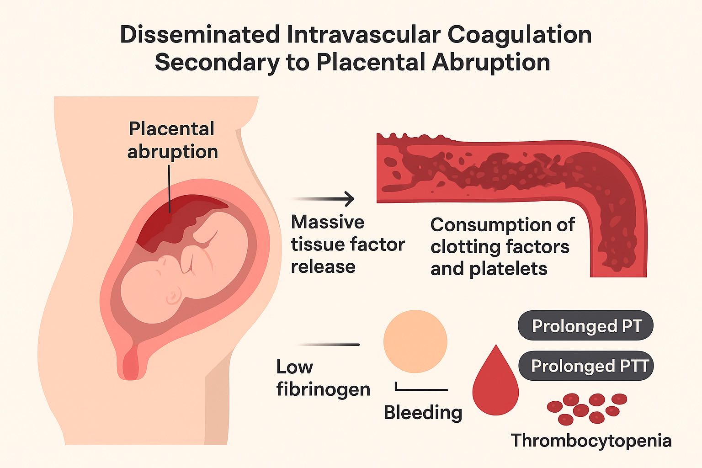

# MCQs for Portal - Obstetrics & Gynecology

---

## 1. Anatomy

### Q 01: Anatomy (Female Reproductive System)

**Question (ID: 714025):**
A primigravida in active labor requests pain relief. A pudendal nerve block is planned. The needle should be inserted near which landmark?

#### Keywords in the Stem to Identify the Correct Option

- **"Pudendal nerve block"** – Directly points to the target nerve for anesthesia.
- **"Landmark"** – Indicates the question is asking for an anatomical point of needle insertion.

The pudendal nerve is consistently located near the ischial spine, making it the essential landmark for performing a pudendal nerve block during labor.

#### Explanation

**✓ (Option B) Ischial spine:**

- **Correct landmark for pudendal nerve block.**
- The pudendal nerve passes posterior to the ischial spine and medial to the sacrospinous ligament.
- During a transvaginal pudendal nerve block, the ischial spine is palpated through the vaginal wall as a bony prominence.
- A needle is inserted near the ischial spine to deliver local anesthetic around the pudendal nerve, providing pain relief in the perineum and lower vagina during late labor or episiotomy.

**(Option A) Pubic symphysis:**

- Not related to pudendal nerve.
- This midline structure is an anterior bony landmark, associated more with bladder and pelvic bone anatomy.
- It is not close to the course of the pudendal nerve.

**(Option C) Sacral promontory:**

- Too high and posterior.
- The sacral promontory marks the border between the lumbar spine and sacrum, and is part of the pelvic inlet.
- It is not near the ischial spine or pudendal nerve, and thus not used for a pudendal block.

**(Option D) Iliac crest:**

- Lateral and superior landmark.
- The iliac crest is the uppermost edge of the ilium, used for lumbar puncture (L4 level) identification.
- It is not near the pelvic outlet or pudendal nerve.

**(Option E) Greater sciatic foramen:**

- Incorrect approach site.
- While the pudendal nerve exits the pelvis through the greater sciatic foramen, the block is not performed here.
- It re-enters via the lesser sciatic foramen and becomes accessible near the ischial spine, which is the correct landmark.

#### Key Concept

Pudendal nerve block is performed transvaginally by palpating the ischial spine, where the pudendal nerve lies close to the sacrospinous ligament. This provides anesthesia to the perineum, vulva, and lower vagina — crucial for instrumental deliveries or episiotomy.

**Subject:** Obstetrics & Gynecology (Pelvic Anatomy)
**System:** Reproductive System – Nerve Supply
**Topic:** Anatomy – Pelvic Nerve Landmarks and Nerve Blocks

#### Anatomy – Pelvic Nerve Landmarks and Nerve Blocks

| Nerve / Block             | Key Landmark(s)                                                  | Clinical Use / Relevance                                          |
| ------------------------- | ---------------------------------------------------------------- | ----------------------------------------------------------------- |
| Pudendal Nerve Block      | Ischial spine, sacrospinous ligament                             | Perineal anesthesia during labor, episiotomy, or forceps delivery |
| Ilioinguinal Nerve Block  | 2 cm medial and superior to anterior superior iliac spine (ASIS) | Anesthesia for inguinal hernia repair, scrotal/labial surgery     |
| Genitofemoral Nerve Block | Over inguinal ligament near femoral artery                       | Pain control in upper anterior scrotum/labia majora               |
| Caudal Epidural Block     | Sacral hiatus between sacral cornua (S4–S5)                      | Pediatric surgeries and labor analgesia (less common now)         |
| Lumbar Plexus Block       | Psoas compartment (near L3 vertebra)                             | Anesthesia for hip/knee surgeries; rarely used in obstetrics      |
| Sciatic Nerve Block       | Midpoint between greater trochanter and ischial tuberosity       | Anesthesia of posterior thigh and most of lower leg               |
| Obturator Nerve Block     | Obturator foramen (deep to adductor muscles)                     | Bladder surgery, spastic adduction of thigh, TURBT procedures     |

**Summary Point:**
Pudendal nerve block is the most important for obstetric perineal anesthesia, and the ischial spine is the consistent landmark for accurate nerve localization.

---

### Q 02: Anatomy (Male and Female Pelvis)

**Question (ID: 715002):**
A woman in labor is experiencing failure to progress. Pelvic examination reveals a prominent sacral promontory and narrow interspinous distance. Which labor complication is she most at risk for?

#### Keywords in the Stem to Identify the Correct Option

- **Prominent sacral promontory**
- **Narrow interspinous distance**

**Reason:**
These features indicate midpelvic narrowing, a classic cause of cephalopelvic disproportion, leading to labor arrest/failure to progress.

**Classic Triad:**
Pelvic inlet contraction + midpelvis narrowing + labor arrest → strongly points to cephalopelvic disproportion (CPD).

#### Explanation

**✓ (Option C) Cephalopelvic disproportion:**

- Cephalopelvic disproportion (CPD) refers to a mismatch between the size of the fetal head and the maternal pelvis, preventing the baby from descending through the birth canal.
- The prominent sacral promontory and narrow interspinous diameter are classic signs of an android or anthropoid pelvis, both of which are associated with narrow midpelvis, leading to mechanical obstruction.
- CPD commonly presents as failure to progress during labor, especially during the active phase of the first stage or during descent in the second stage.

**(Option A) Shoulder dystocia:**

- Occurs when the fetal anterior shoulder gets impacted behind the maternal pubic symphysis after the head is delivered.
- More commonly associated with macrosomia, diabetes, or post-term pregnancy.
- Not directly related to pelvic shape or narrow interspinous distance, but more to shoulder-to-head ratio.

**(Option B) Prolonged latent phase:**

- Refers to slow cervical dilation in the early phase of labor (latent phase).
- Usually related to ineffective uterine contractions or sedation, not pelvic anatomy.
- A narrow pelvis more commonly affects the active phase or descent, not the latent phase.

**(Option D) Cord prolapse:**

- Involves the umbilical cord slipping past the presenting part.
- More common in cases of malpresentation (breech, transverse lie) or with artificial rupture of membranes when the presenting part is not engaged.
- Not associated with pelvic architecture.

**(Option E) Postpartum hemorrhage (PPH):**

- Usually caused by uterine atony, retained placenta, trauma, or coagulopathy.
- Not linked with pelvic shape or interspinous diameter.
- May occur in prolonged labor but is not the most direct risk based on the pelvic exam findings described.

#### Key Concept

A narrow midpelvis — characterized by a prominent sacral promontory and reduced interspinous diameter — increases the risk of cephalopelvic disproportion (CPD), leading to failure to progress during labor. This is a classic sign of mechanical obstruction in labor due to pelvic anatomy, most commonly seen in android pelvis.

**Subject:** Obstetrics & Gynecology (Obstetrical Anatomy)
**System:** Female Reproductive System – Obstetric Pelvimetry – Anatomy of Reproductive and Genital Tract - Detailed anatomy of male and female Pelvis - Bones
**Topic:** Obstetrics – Pelvic Types and Their Impact on Labor (Obstetric Pelvimetry)

#### Obstetrics – Pelvic Types and Their Impact on Labor (Obstetric Pelvimetry)

| Pelvic Type      | Anatomical Features                                                                  | Impact on Labor                                                                 |
| ---------------- | ------------------------------------------------------------------------------------ | ------------------------------------------------------------------------------- |
| **Gynecoid**     | • Rounded inlet • Wide subpubic angle • Non-prominent ischial spines           | • Favorable for vaginal delivery • Most common type (≈50% of women)          |
| **Android**      | • Heart-shaped inlet • Narrow interspinous diameter • Prominent ischial spines | • Increased risk of CPD • Arrest of descent common in 2nd stage of labor     |
| **Anthropoid**   | • Oval inlet (anteroposteriorly long) • Narrow transverse diameter                | • Occiput posterior more common • Vaginal delivery possible but difficult    |
| **Platypelloid** | • Flat/oval inlet (transversely wide) • Short anteroposterior diameter            | • Delayed engagement • Often leads to prolonged labor or failure to progress |

---

### Q 03: Anatomy (Developmental Defects)

**Question (ID: 717001):**
A 17-year-old girl presents with primary amenorrhea. She has well-developed breasts and axillary hair. On pelvic examination, the vaginal canal ends blindly, and transabdominal ultrasound reveals absence of uterus with normal ovaries. What is the most likely diagnosis?

**Options:**

- A. Androgen insensitivity syndrome
- B. Turner syndrome
- C. Transverse vaginal septum
- D. Müllerian agenesis (MRKH syndrome)
- E. Kallmann syndrome

**ANSWER: D**

#### Keywords in the Stem to Identify the Correct Option

**Primary amenorrhea** → Suggests an underlying congenital or hormonal abnormality in a pubertal-age girl.

- **Normal breast and axillary hair development** → Indicates normal estrogen production, ruling out hypogonadism or androgen insensitivity.
- **Blind-ending vagina + absent uterus on ultrasound** → Classic for Müllerian agenesis (MRKH) where upper vagina and uterus fail to develop.

**Classic Triad of MRKH Syndrome in the Stem:**

- Primary amenorrhea
- Normal secondary sexual characteristics (breasts, axillary hair)
- Absent uterus and blind vagina

This triad strongly points toward MRKH syndrome (Müllerian agenesis).

#### Explanation

**✓ (Option D) Müllerian agenesis (MRKH syndrome):**

- Also known as Mayer-Rokitansky-Küster-Hauser syndrome, this is a congenital disorder characterized by the aplasia or hypoplasia of the Müllerian ducts, leading to the absence or underdevelopment of the uterus and upper two-thirds of the vagina.
- Patients are phenotypic females with normal secondary sexual characteristics (breasts, axillary/pubic hair), but absence of uterus and upper vagina due to Müllerian duct agenesis.
- Ovarian function is normal, so estrogen-dependent changes (breast development) occur normally.

**(Option A) Androgen insensitivity syndrome (AIS):**

- These individuals are genetically male (46,XY) but resistant to androgens.
- They present with female external genitalia and breast development, but absent pubic/axillary hair and no uterus or ovaries.
- Ovaries are absent, and testes are usually intra-abdominal or inguinal.

**(Option B) Turner syndrome:**

- Characterized by 45,X karyotype with streak ovaries, leading to low estrogen, no breast development, and primary amenorrhea.
- Usually associated with short stature, webbed neck, and cardiac/renal anomalies.
- Uterus is present due to the female phenotype.

**(Option C) Transverse vaginal septum:**

- This is a structural outflow tract abnormality, with normal uterus and ovaries.
- Presents with cyclic pelvic pain, hematocolpos, and primary amenorrhea.
- Vaginal canal may be short or obstructed, but uterus is present on imaging.

**(Option E) Kallmann syndrome:**

- A GnRH deficiency disorder associated with anosmia, hypogonadism, and delayed or absent puberty.
- Presents with absent breast development, low FSH/LH, and normal uterus.
- Ovaries are present but under-stimulated.

#### Key Concepts

- **Müllerian agenesis (MRKH)** = Normal female phenotype, breast and hair development, but absent uterus and upper vagina, normal ovaries.
- Differentiated from AIS by presence of pubic/axillary hair and 46,XX karyotype.

**Subject:** Obstetrics & Gynecology (Gynecological Anatomy) - Closely related to Embryology (for developmental origin of Müllerian ducts)
**System:** Female Reproductive System - Anatomy of Reproductive and Genital Tract - Developmental defects in the female genitourinary tract - Structural problems of pelvic organs
**Topic:** Gynecology – Primary Amenorrhea Due to Congenital Anomalies of the Female Reproductive Tract
**Alternative Topic:** Gynecology – Disorders of Sexual Development (DSD)

#### Gynecology – Primary Amenorrhea Due to Congenital Anomalies of the Female Reproductive Tract

| Condition                                 | Key Features                                                                                          | Differentiating Points                                                      |
| ----------------------------------------- | ----------------------------------------------------------------------------------------------------- | --------------------------------------------------------------------------- |
| **Müllerian Agenesis (MRKH Syndrome)**    | • 46,XX female • Absent uterus and upper vagina • Normal ovaries and breast development         | Normal pubic/axillary hair; no uterus; secondary sexual traits normal       |
| **Androgen Insensitivity Syndrome (AIS)** | • 46,XY genotype • Female external genitalia, no uterus or ovaries • Breast development present | Absent pubic/axillary hair; intra-abdominal testes; male karyotype (XY)     |
| **Transverse Vaginal Septum**             | • Obstructive anomaly • Normal uterus and ovaries • Amenorrhea with cyclic pain                 | Hematocolpos on imaging; uterus present; seen in outflow tract obstruction  |
| **Imperforate Hymen**                     | • Outflow tract blockage • Primary amenorrhea + cyclic pain • Bulging bluish hymenal membrane   | Simple to diagnose on exam; uterus and vagina are normal                    |
| **Turner Syndrome**                       | • 45,X karyotype • Streak ovaries, no puberty • Short stature, webbed neck                      | No breast development; uterus present; hypergonadotropic hypogonadism       |
| **Kallmann Syndrome**                     | • GnRH deficiency • No puberty + anosmia • Low FSH/LH                                           | No breast development, uterus present, normal karyotype, no smell (anosmia) |

#### Gynecology – Disorders of Sexual Development (DSD)

| Condition / DSD Type                      | Key Features                                                                                          | Differentiating Points                                                                               |
| ----------------------------------------- | ----------------------------------------------------------------------------------------------------- | ---------------------------------------------------------------------------------------------------- |
| **Müllerian Agenesis (MRKH Syndrome)**    | • 46,XX female, normal ovaries • Absent uterus and upper vagina • Normal breast and pubic hair  | • Female phenotype • Uterus absent • Pubic/axillary hair present • Normal karyotype         |
| **Androgen Insensitivity Syndrome (AIS)** | • 46,XY male genotype • Female external genitalia, absent uterus • Testes present (undescended) | • Absent pubic/axillary hair • Normal breasts • Male karyotype • Intra-abdominal testes     |
| **5α-Reductase Deficiency**               | • 46,XY genotype • Female external genitalia at birth • Virilization at puberty                 | • Raised as female • Clitoromegaly or penis growth at puberty • No breast development          |
| **Congenital Adrenal Hyperplasia (CAH)**  | • 46,XX genotype • Ambiguous genitalia at birth • High androgens, salt-wasting crisis possible  | • Early virilization • Electrolyte imbalance • Uterus present • Enlarged clitoris           |
| **Turner Syndrome (Gonadal Dysgenesis)**  | • 45,X karyotype • Streak ovaries, short stature • Primary amenorrhea                           | • No secondary sexual characteristics • Uterus present • Webbed neck • Coarctation of aorta |
| **Kallmann Syndrome**                     | • 46,XX or 46,XY • GnRH deficiency • No puberty, anosmia                                        | • Low FSH/LH • No breast/testicular development • Anosmia is classic clue                      |

**Notes:**

- DSD involves discordance between chromosomal, gonadal, or phenotypic sex.
- Important to differentiate based on karyotype, internal structures, secondary sexual characteristics, and hormonal profile.

---

### Q 04: Anatomy (Placenta)

**Question (ID: 719001):**
A 28-year-old pregnant woman in her 24th week develops rising postprandial glucose levels despite no prior history of diabetes. Lab testing shows increased human placental lactogen (hPL). What is the most likely physiological role of hPL contributing to this finding?

**Options:**

- A. Enhances maternal thyroid activity
- B. Promotes fetal surfactant production
- C. Increases maternal insulin resistance to supply glucose to fetus
- D. Inhibits uterine contractility in the third trimester
- E. Suppresses fetal cortisol synthesis

**ANSWER: C**

#### Keywords in the Stem to Identify Correct Option

- **"24th week"** → Indicates mid-second trimester, when hPL levels peak and begin exerting metabolic effects.
- **"Rising postprandial glucose levels"** → Suggests insulin resistance, a hallmark of hPL activity in pregnancy.

These keywords point to the metabolic role of hPL in increasing maternal insulin resistance to prioritize fetal glucose supply.

#### Explanation

**✓ (Option C) Increases maternal insulin resistance to supply glucose to fetus:**

- Human placental lactogen (hPL) is a hormone produced by the syncytiotrophoblast of the placenta. Its primary function is to alter maternal metabolism to ensure a continuous supply of glucose and amino acids to the developing fetus.
- It achieves this by acting as an antagonist to insulin. This causes the mother's cells to become less sensitive to insulin, leading to maternal insulin resistance.
- As a result, glucose remains in the bloodstream longer after meals, making more available for placental transfer and fetal uptake.
- This physiological change, while beneficial for the fetus, can lead to elevated maternal blood glucose levels, particularly after eating, and is the underlying mechanism for gestational diabetes.

**(Option A) Enhances maternal thyroid activity:**

- This is incorrect. While pregnancy does increase thyroid gland activity, this is primarily driven by human chorionic gonadotropin (hCG), which has a similar structure to thyroid-stimulating hormone (TSH) and can weakly stimulate the thyroid.
- hPL does not have a significant role in enhancing maternal thyroid activity.

**(Option B) Promotes fetal surfactant production:**

- This is incorrect. The production of fetal surfactant, which is crucial for lung maturation, is primarily stimulated by fetal cortisol.
- While hPL has some metabolic effects, it is not the main hormone responsible for the direct promotion of surfactant production.

**(Option D) Inhibits uterine contractility in the third trimester:**

- This is incorrect. Uterine contractility is primarily inhibited by progesterone, which maintains uterine quiescence throughout most of the pregnancy.
- hPL does not have a significant role in inhibiting uterine contractions.

**(Option E) Suppresses fetal cortisol synthesis:**

- This is incorrect. Fetal cortisol is essential for the maturation of many fetal organs, including the lungs, and its synthesis is regulated by the fetal hypothalamic-pituitary-adrenal axis.
- hPL does not suppress fetal cortisol synthesis; in fact, the two hormones have distinct and largely unrelated physiological roles.

#### Key Concepts

- **Human Placental Lactogen (hPL):** A hormone produced by the placenta that acts as an insulin antagonist, increasing maternal insulin resistance to ensure adequate glucose supply for the fetus.
- **Gestational Diabetes:** A condition of impaired glucose tolerance that develops during pregnancy, often due to the insulin-antagonistic effects of hPL and other placental hormones.
- **Insulin Resistance:** A state where the body's cells don't respond effectively to insulin, leading to higher blood glucose levels. This is a normal physiological adaptation in pregnancy, but can become pathological.

**Subject:** Obstetrics & Gynecology (Physiology)
**System:** Female Reproductive System - Endocrine System + Pregnancy-related Metabolic Physiology - Anatomy of Reproductive and Genital Tract – Placenta - Function
**Topic:** Physiology – Endocrine Adaptations in Pregnancy

#### Physiology – Endocrine Adaptations in Pregnancy

| Hormone                                | Source                               | Physiological Role in Pregnancy                                                                            |
| -------------------------------------- | ------------------------------------ | ---------------------------------------------------------------------------------------------------------- |
| **hPL (Human Placental Lactogen)**     | Syncytiotrophoblast of placenta      | • Increases maternal insulin resistance • Promotes lipolysis • Ensures glucose availability to fetus |
| **hCG (Human Chorionic Gonadotropin)** | Syncytiotrophoblast of placenta      | • Maintains corpus luteum to produce progesterone in early pregnancy • Mimics TSH → ↑ thyroid hormones  |
| **Progesterone**                       | Corpus luteum (early), then placenta | • Maintains uterine quiescence • Supports endometrium • Inhibits lactation until delivery            |
| **Estrogen**                           | Placenta                             | • Promotes uterine growth • Breast development • Increases uteroplacental blood flow                 |
| **Prolactin**                          | Maternal anterior pituitary          | • Stimulates breast tissue for lactation • Modulates maternal metabolism                                |
| **Cortisol (↑ due to CRH)**            | Maternal adrenal + placental CRH     | • Aids in fetal organ maturation • Contributes to maternal hyperglycemia in late pregnancy              |

**Summary Key Point:**
Pregnancy involves complex endocrine adaptations—especially from placenta-derived hormones—that prioritize fetal growth by altering maternal metabolism, particularly glucose and fat metabolism.

---

## 2. Pathology

### Q 05: Pathology (Malignancies)

**Question (ID: 738003):**
A patient with cervical cancer presents for clinical staging. On pelvic examination, the tumor is found to extend into the parametrium bilaterally, but does not reach the pelvic sidewalls. No vaginal involvement is noted. Which FIGO stage corresponds to this clinical presentation?

**Options:**

- A. IB
- B. IIA
- C. IIIA
- D. IIB
- E. IIIB

**ANSWER: D**

#### Keywords in the Stem to Identify Correct Option

- **"Extends into the parametrium bilaterally"** – Indicates tumor invasion beyond the cervix into parametrium, a hallmark of stage IIB.
- **"Does not reach the pelvic sidewalls"** – Excludes stage IIIB, which involves pelvic sidewall extension.

No classic triad is present in this stem; it's primarily focused on local tumor extension landmarks.

#### Explanation

**✓ (Option D) IIB:**

- Tumor invades the parametrium but does not reach the pelvic sidewall.
- Can be unilateral or bilateral parametrial involvement.
- Correct answer as the tumor extends bilaterally into parametrium without reaching sidewalls.

**(Option A) IB:**

- Tumor confined strictly to the cervix but clinically visible or larger than microscopic disease.
- No spread beyond the cervix or into surrounding tissues (parametrium or vagina).
- Not correct here since the tumor extends beyond the cervix into parametrium.

**(Option B) IIA:**

- Tumor invades beyond the uterus but not into the parametrium.
- Involvement includes upper two-thirds of the vagina without parametrial involvement.
- Not correct here because parametrium involvement is present.

**(Option C) IIIA:**

- Tumor extends to the lower third of the vagina but does not involve the pelvic sidewall.
- No parametrium involvement required for this stage.
- Not correct since the question states no vaginal involvement.

**(Option E) IIIB:**

- Tumor extends to the pelvic sidewall and/or causes hydronephrosis or non-functioning kidney.
- Represents more advanced local disease.
- Not correct here since pelvic sidewalls are not involved.

**More detailed explanation of the right option (D. IIB):**
Stage IIB is defined as cervical cancer where the tumor has extended beyond the cervix into the parametrium, but it has not yet reached the pelvic sidewalls. This indicates more local spread than stages IB or IIA, but less extensive than stage IIIB where sidewall involvement or hydronephrosis occurs. The parametrium is the fibrous tissue lateral to the cervix and uterus, so involvement here signals deeper local invasion, which often affects treatment choices such as combined chemoradiotherapy.

#### Key Concept

FIGO Stage IIB cervical cancer is characterized by tumor spread into the parametrium without reaching the pelvic sidewalls, indicating locally advanced but not yet extensively invasive disease beyond the parametrium.

**Subject:** Obstetrics & Gynecology (Pathology) - Pathology (cervical cancer staging is a clinical-pathological correlation) and Clinical Oncology (cancer staging)
**System:** Female Reproductive System (specifically the cervix and adjacent pelvic structures) - Pathology in Relation to Obstetrics and Gynecology – Malignancies - Gynecological malignancies and staging - Cervical Cancer – Pathology and Staging
**Topic:** Cervical Cancer – FIGO Clinical Staging and Tumor Spread

#### Cervical Cancer – FIGO Clinical Staging and Tumor Spread

| FIGO Stage     | Tumor Spread Description                                                                 | Key Clinical Features                                          |
| -------------- | ---------------------------------------------------------------------------------------- | -------------------------------------------------------------- |
| **Stage I**    | • Tumor confined to cervix                                                               | Clinically visible lesion confined to cervix only              |
| **Stage IB**   | • Clinically visible lesion >5 mm, confined to cervix                                    | No spread beyond cervix                                        |
| **Stage II**   | • Tumor invades beyond uterus but not to pelvic sidewall or lower third of vagina        | Parametrial involvement or vaginal upper 2/3 involvement       |
| **Stage IIA**  | • Involves upper two-thirds of vagina, no parametrium involvement                        | Vaginal involvement without parametrial invasion               |
| **Stage IIB**  | • Tumor extends into parametrium, not reaching pelvic sidewall                           | • Parametrial invasion • No pelvic sidewall involvement     |
| **Stage III**  | • Tumor extends to pelvic sidewall and/or lower third of vagina or causes hydronephrosis | • Pelvic sidewall involvement or • Lower vagina involvement |
| **Stage IIIA** | • Involvement of lower third of vagina, no sidewall involvement                          | Vaginal lower third involvement                                |
| **Stage IIIB** | • Extension to pelvic sidewall and/or hydronephrosis                                     | Sidewall involvement or ureteral obstruction                   |
| **Stage IV**   | • Tumor invades bladder, rectum or distant organs                                        | Invasion of adjacent organs or distant metastasis              |
| **Stage IVA**  | • Spread to adjacent pelvic organs (bladder/rectum)                                      | Clinical invasion of bladder or rectum                         |
| **Stage IVB**  | • Distant metastasis (beyond pelvis)                                                     | Metastatic disease to distant organs                           |

#### Differential Diagnoses

_(Consider when a patient presents with a cervical mass or lesion suspicious for cervical cancer)_

| Condition                                                 | Brief Description                                              | How to Differentiate                                                                     |
| --------------------------------------------------------- | -------------------------------------------------------------- | ---------------------------------------------------------------------------------------- |
| **Cervicitis (Chronic or Acute)**                         | Inflammation of the cervix caused by infection (e.g., STDs)    | • Usually presents with discharge, pain • Biopsy shows inflammation, not malignancy   |
| **Benign Cervical Polyps**                                | Localized benign growths of cervical mucosa                    | • Polypoid appearance • No parametrium involvement • Histology benign              |
| **Cervical Dysplasia / CIN**                              | Precancerous epithelial changes                                | • Detected on Pap smear and biopsy • No gross mass or parametrial invasion            |
| **Endometrial Carcinoma**                                 | Malignancy of uterine lining that can extend to cervix         | • Imaging and biopsy distinguish origin • Tumor usually starts in endometrium         |
| **Other Gynecologic Malignancies (e.g., vaginal cancer)** | May mimic cervical cancer clinically                           | • Different site of origin on examination and imaging • Histopathology confirms       |
| **Pelvic Inflammatory Disease (PID)**                     | • Infection causing pelvic pain • May cause tissue swelling | • Systemic signs of infection • Elevated inflammatory markers • No tumor on biopsy |

**Note:**
Clinical examination combined with biopsy and imaging is key to differentiate cervical cancer from these conditions. The presence of parametrial invasion is highly suggestive of invasive cervical cancer rather than benign or inflammatory causes.

---

### Q 06: Pathology (Miscarriage)

**Question (ID: 739003):**
A 30-year-old woman at 11 weeks has heavy vaginal bleeding with crampy pain. Cervical os is dilated, and products of conception are visible but not expelled. Which is the correct diagnosis?

**Options:**

- A. Threatened miscarriage
- B. Incomplete miscarriage
- C. Inevitable miscarriage
- D. Missed miscarriage
- E. Septic miscarriage

**ANSWER: C**

#### Keywords in the Stem to Identify Correct Option

- **"Cervical os is dilated"** – Indicates miscarriage cannot be stopped; rules out threatened or missed miscarriage.
- **"Products of conception visible but not expelled"** – Shows miscarriage is in progress but tissue not yet passed, differentiating it from incomplete miscarriage.
- **Classic triad:** "Heavy vaginal bleeding + Crampy pain + Dilated cervical os" – Classic presentation of inevitable miscarriage.

#### Explanation

**✓ (Option C) Inevitable miscarriage:**

- **Definition:** A miscarriage that cannot be stopped because the cervical os is dilated and the uterus is actively trying to expel the products of conception.
- **Clinical features:** Heavy bleeding, crampy pain, dilated cervix, products of conception may be visible at the cervical os but not yet expelled.
- **Management:** Often requires expectant, medical, or surgical management to ensure complete evacuation and prevent complications.

**(Option A) Threatened miscarriage:**

- Cervix remains closed, bleeding may be mild, pain minimal.
- Products of conception still in uterus.
- In this case, cervical os is dilated, so it is not threatened miscarriage.

**(Option B) Incomplete miscarriage:**

- Some products of conception have already been expelled, cervical os dilated, continued bleeding and cramping.
- Key difference: this patient has no tissue expelled yet, so it is not incomplete.

**(Option D) Missed miscarriage:**

- Fetus has died but remains in uterus, cervical os closed, minimal or no bleeding/pain.
- Not consistent with this clinical scenario.

**(Option E) Septic miscarriage:**

- Miscarriage complicated by infection: fever, foul-smelling discharge, uterine tenderness.
- No infection signs here.

#### Key Concept

- **Inevitable miscarriage** occurs when cervix is dilated, bleeding and cramping are present, and products are still in the uterus.
- Differentiation from incomplete miscarriage: no tissue has been expelled yet, although it may be visible at the cervical os.

**Subject:** Obstetrics & Gynecology (specifically Obstetrics – Early Pregnancy Complications)
**System:** Female Reproductive System (Uterus, Cervix, Pregnancy-related structures) - Pathology in Relation to Obstetrics and Gynecology – Implantation and Early Pregnancy – Miscarriage
**Topic:** Early Pregnancy Complications – Miscarriage (Inevitable, Threatened, Incomplete, Missed, Septic)

#### Early Pregnancy Complications – Miscarriage

| Type of Miscarriage | Clinical Features / Cervical Status                                                                     | Key Points / Management                                                                  |
| ------------------- | ------------------------------------------------------------------------------------------------------- | ---------------------------------------------------------------------------------------- |
| **Threatened**      | • Vaginal bleeding • Mild crampy pain • Cervical os closed • Products in uterus                | • Pregnancy may continue • Conservative management • Rest • Follow-up           |
| **Inevitable**      | • Heavy bleeding • Crampy pain • Cervical os dilated • Products not yet expelled               | • Miscarriage cannot be stopped • Expectant, medical, or surgical management          |
| **Incomplete**      | • Heavy bleeding • Crampy pain • Cervical os dilated • Partial expulsion of products           | Evacuation needed to prevent hemorrhage or infection                                     |
| **Missed**          | • Usually asymptomatic or mild spotting • Cervical os closed • Fetus dead but retained            | Management: • Medical or surgical evacuation • May wait for spontaneous resolution |
| **Septic**          | • Fever • Foul-smelling discharge • Uterine tenderness • Bleeding • Cervical os may be open | Emergency management: • Antibiotics + evacuation • Monitor for sepsis              |

#### Differential Diagnosis for Early Pregnancy Vaginal Bleeding (Miscarriage)

| Condition                                  | Key Features to Differentiate                                                                                                                                                  |
| ------------------------------------------ | ------------------------------------------------------------------------------------------------------------------------------------------------------------------------------ |
| **Ectopic Pregnancy**                      | • Amenorrhea • Abdominal pain (usually unilateral) • Negative or low intrauterine pregnancy on ultrasound • Possible shoulder tip pain • Risk of rupture and shock |
| **Implantation Bleeding**                  | • Very mild spotting around expected menses • Usually no cramping or cervical dilation • Occurs in early implantation (around 4–5 weeks)                                 |
| **Molar Pregnancy (Hydatidiform Mole)**    | • Vaginal bleeding • Uterus larger than gestational age • Markedly elevated β-hCG • Absence of fetal parts • Vesicular pattern on ultrasound                       |
| **Cervical Polyps / Infection**            | • Intermittent bleeding • Usually not associated with cramping or expulsion • Cervix may show lesions or inflammation                                                    |
| **Coagulopathies / Anticoagulant Therapy** | • Unexplained or recurrent bleeding without signs of miscarriage • Systemic bleeding tendencies • Normal pregnancy on imaging                                            |

**Note:**
In this MCQ scenario, the classic triad (heavy bleeding + crampy pain + dilated cervical os) with products visible but not expelled points strongly to inevitable miscarriage, making other differentials less likely but important to consider if diagnosis is unclear.

---

### Q 07: Pathology (Ectopic Pregnancy)

**Question (ID: 739015):**
A 32-year-old woman presents with 6 weeks of amenorrhea, mild pelvic pain, and a positive urine pregnancy test. Transvaginal ultrasound does not show an intrauterine gestational sac. Which investigation is most helpful to confirm the diagnosis?

**Options:**

- A. Quantitative serum β-hCG and repeat after 48 hours
- B. Serum progesterone level
- C. Serum LH level
- D. MRI pelvis
- E. Urinary β-hCG

**ANSWER: A**

#### Keywords in the Stem to Identify Correct Option

- **"6 weeks of amenorrhea"** – Suggests early pregnancy where ultrasound may not yet detect intrauterine gestation, pointing toward need for serial β-hCG.
- **"No intrauterine gestational sac on transvaginal ultrasound"** – Classic clue for ectopic pregnancy or very early pregnancy, making quantitative β-hCG rise the key diagnostic tool.
- **"Mild pelvic pain + positive pregnancy test"** – Part of the classic ectopic pregnancy triad: amenorrhea, abdominal/pelvic pain, vaginal bleeding (here mild pain only); supports need for serial β-hCG.

#### Explanation

**✓ (Option A) Quantitative serum β-hCG and repeat after 48 hours:**

- Quantitative β-hCG is the most useful test in this scenario.
- In early pregnancy, β-hCG should approximately double every 48 hours.
- In ectopic pregnancy, β-hCG often rises more slowly or plateaus, suggesting abnormal implantation.
- Serial measurements help differentiate early intrauterine pregnancy vs ectopic pregnancy before ultrasound findings are conclusive.

**(Option B) Serum progesterone level:**

- Low progesterone (<5 ng/mL) may indicate nonviable pregnancy.
- However, it cannot reliably distinguish ectopic from failing intrauterine pregnancy, so it is less specific.

**(Option C) Serum LH level:**

- LH is used to predict ovulation and does not help diagnose pregnancy or ectopic pregnancy.
- Not relevant in this clinical scenario.

**(Option D) MRI pelvis:**

- MRI is rarely needed in early pregnancy evaluation.
- Ultrasound and β-hCG are usually sufficient; MRI is reserved for complicated or ambiguous cases.

**(Option E) Urinary β-hCG:**

- A urine pregnancy test confirms pregnancy but cannot quantify hCG or monitor its rise.
- Cannot reliably help differentiate ectopic from early intrauterine pregnancy.

#### Key Concept

- **Serial quantitative serum β-hCG** is the most helpful investigation when transvaginal ultrasound does not show an intrauterine gestational sac.
- Abnormal rise or plateau of β-hCG suggests ectopic pregnancy or failing intrauterine pregnancy.

**Subject:** Obstetrics & Gynecology
**System:** Female Reproductive System (Early Pregnancy) - Pathology in Relation to Obstetrics and Gynecology – Implantation and Early Pregnancy – Ectopic Pregnancy
**Topic:** Early Pregnancy Complications – Ectopic Pregnancy: Diagnosis

#### Early Pregnancy Complications – Ectopic Pregnancy: Diagnosis

| Investigation                         | Findings/Role                                                                                  | Notes / Clinical Relevance                                              |
| ------------------------------------- | ---------------------------------------------------------------------------------------------- | ----------------------------------------------------------------------- |
| **Transvaginal Ultrasound (TVS)**     | • Absence of intrauterine gestational sac • May see adnexal mass or free fluid              | • First-line imaging • Sensitive after 5–6 weeks of amenorrhea       |
| **Quantitative serum β-hCG (serial)** | Abnormal rise (less than doubling in 48 hours) suggests ectopic pregnancy or failing pregnancy | Most helpful for early diagnosis when TVS is inconclusive               |
| **Serum progesterone**                | Low (<5 ng/mL) indicates non-viable pregnancy                                                  | Cannot reliably distinguish ectopic vs nonviable intrauterine pregnancy |
| **Urine pregnancy test**              | Positive confirms pregnancy                                                                    | • Non-quantitative • Cannot monitor progression                      |
| **MRI pelvis**                        | Rarely used; may detect complex cases                                                          | Reserved for ambiguous or complicated cases                             |

#### Differential Diagnosis of Suspected Ectopic Pregnancy

| Condition                                               | Key Features                                               | Distinguishing Points                                                                                         |
| ------------------------------------------------------- | ---------------------------------------------------------- | ------------------------------------------------------------------------------------------------------------- |
| **Early Intrauterine Pregnancy (Viable)**               | • Amenorrhea • Positive pregnancy test                  | • Ultrasound eventually shows intrauterine gestational sac • β-hCG rises normally (≈doubling every 48 hrs) |
| **Miscarriage (Threatened or Incomplete)**              | • Vaginal bleeding • Pelvic pain                        | • Ultrasound may show intrauterine products of conception • β-hCG may plateau or decline                   |
| **Gestational Trophoblastic Disease (Molar Pregnancy)** | • Amenorrhea • Uterine enlargement • Very high β-hCG | • Ultrasound shows "snowstorm" pattern • β-hCG markedly elevated                                           |
| **Ovarian Cyst / Rupture**                              | • Acute pelvic pain • Possible mild bleeding            | • Ultrasound shows cystic ovarian lesion • β-hCG may be positive if coincidental early pregnancy           |
| **Pelvic Inflammatory Disease (PID)**                   | • Lower abdominal pain • Fever • Vaginal discharge   | • No intrauterine sac • β-hCG usually negative • Systemic signs of infection                            |

---

### Q 08: Pathology (Obstetric Hemorrhage)

**Question (ID: 740008):**
A 35-week abruption with fetal demise shows oozing from IV sites and postpartum bleeding disproportionate to loss. Labs: low fibrinogen, prolonged PT. Which complication explains this bleeding profile?

**Options:**

- A. HELLP syndrome
- B. AFE
- C. Von Willebrand disease
- D. DIC
- E. Hemophilia carrier status

**ANSWER: D**

#### Keywords in the Stem to Identify Correct Option

- **"35-week abruption with fetal demise"** – Classic trigger for DIC in obstetrics.
- **"Oozing from IV sites and postpartum bleeding disproportionate to loss"** – Suggests consumptive coagulopathy rather than primary platelet or factor defect.
- **"Low fibrinogen, prolonged PT"** – Hallmark lab pattern of DIC (consumption of clotting factors).

**Classic triad in stem:**
Bleeding + Abnormal labs (low fibrinogen, prolonged PT) + Triggering obstetric event (placental abruption/fetal demise) → points to DIC.

#### Explanation

**✓ (Option D) DIC (Disseminated Intravascular Coagulation):**

- Triggered by placental abruption, especially with fetal demise.
- **Pathophysiology:** Massive tissue factor release → widespread clotting → consumption of clotting factors and platelets → bleeding.
- **Lab findings:** Low fibrinogen, prolonged PT/PTT, thrombocytopenia, elevated D-dimer.
- **Clinical:** Oozing from IV sites, disproportionate postpartum bleeding, ecchymoses.

**(Option A) HELLP syndrome:**

- Hemolysis, Elevated Liver enzymes, Low Platelets.
- Usually presents with RUQ pain, nausea, hypertension, and thrombocytopenia.
- Does not typically cause prolonged PT or low fibrinogen as the primary issue.

**(Option B) AFE (Amniotic Fluid Embolism):**

- Rare, sudden onset cardiopulmonary collapse during labor or postpartum.
- May cause DIC, but classic presentation includes respiratory distress and hypotension first.

**(Option C) Von Willebrand disease:**

- Congenital bleeding disorder causing mucosal bleeding, easy bruising, prolonged bleeding.
- Lab pattern usually: prolonged bleeding time, may have low vWF, PT and fibrinogen often normal.

**(Option E) Hemophilia carrier status:**

- Usually asymptomatic unless extreme factor deficiency.
- Mainly affects males, females may have mild bleeding.
- Lab pattern: prolonged aPTT, normal PT, fibrinogen usually normal.

#### Key Concept

Placental abruption, especially with fetal demise, can trigger DIC, which presents with widespread bleeding, low fibrinogen, prolonged PT, and oozing from IV sites. Early recognition is crucial for management.

**Subject:** Obstetrics & Gynecology
**System:** Female Reproductive System (Hematologic / Coagulation system - secondary to obstetric complication) - Pathology in Relation to Obstetrics and Gynecology – Obstetric Complications - Obstetric Hemorrhage - Antepartum Hemorrhage (APH)
**Topic:** Obstetrics – Intrapartum/Postpartum Hemorrhage: Disseminated Intravascular Coagulation (DIC) Secondary to Placental Abruption

#### DIC Secondary to Placental Abruption in Obstetrics

| Aspect                         | Details                                                                                                                                                                         | Clinical/Relevance                                                     |
| ------------------------------ | ------------------------------------------------------------------------------------------------------------------------------------------------------------------------------- | ---------------------------------------------------------------------- |
| **Definition/Pathophysiology** | DIC is a consumptive coagulopathy triggered by massive tissue factor release from placental abruption → widespread microthrombi → depletion of clotting factors and platelets   | Explains bleeding disproportionate to visible blood loss               |
| **Triggers in Obstetrics**     | • Placental abruption, especially with fetal demise • Amniotic fluid embolism • Severe preeclampsia • HELLP syndrome                                                   | High-risk obstetric patients require close monitoring for coagulopathy |
| **Clinical Features**          | • Excessive bleeding (postpartum, IV sites) • Oozing from mucosa • Hypotension • Pallor                                                                                | Early recognition critical to prevent maternal morbidity/mortality     |
| **Laboratory Findings**        | • Low fibrinogen • Prolonged PT/PTT • Thrombocytopenia • Elevated D-dimer • Schistocytes on blood smear                                                             | Lab pattern confirms consumptive coagulopathy                          |
| **Management**                 | • Immediate obstetric management (delivery if ongoing abruption) • Blood product replacement (FFP, platelets, cryoprecipitate) • Supportive care • Monitor coagulation | Multidisciplinary approach improves maternal outcomes                  |
| **Differential Diagnosis**     | • HELLP syndrome • AFE • Congenital bleeding disorders (vWD, Hemophilia) • Liver disease                                                                               | Labs and clinical context distinguish DIC from other causes            |

#### Differential Diagnosis for Bleeding in Late Pregnancy / Postpartum

| Condition                                | Key Differentiating Features                                                                                     | Lab Findings                                                                                        |
| ---------------------------------------- | ---------------------------------------------------------------------------------------------------------------- | --------------------------------------------------------------------------------------------------- |
| **DIC (from abruption)** ✓               | • Triggered by placental abruption/fetal demise • Bleeding disproportionate to loss • Oozing from IV sites | • Low fibrinogen • Prolonged PT/PTT • Thrombocytopenia • Elevated D-dimer                  |
| **HELLP syndrome**                       | • Hemolysis, elevated liver enzymes, low platelets • Usually RUQ pain, hypertension, nausea/vomiting          | • Thrombocytopenia • Elevated AST/ALT • Hemolysis labs (LDH, peripheral smear)                |
| **Amniotic Fluid Embolism (AFE)**        | • Sudden cardiorespiratory collapse • Hypotension • Dyspnea • Coagulopathy                              | • May show DIC labs secondary to embolism • Clinical picture dominates                           |
| **Von Willebrand Disease (vWD)**         | • Congenital • Mucosal bleeding • Menorrhagia • Postpartum hemorrhage                                   | • Prolonged bleeding time • Low vWF antigen/activity • Usually normal PT/PTT                  |
| **Hemophilia carrier/factor deficiency** | • Family history • Usually male infants affected • Mild bleeding in carriers                               | • Prolonged aPTT • Normal PT and fibrinogen                                                      |
| **Liver disease**                        | • Chronic liver disease • May have jaundice, coagulopathy                                                     | • Prolonged PT/PTT • Low fibrinogen • Thrombocytopenia • Context/history helps distinguish |

---

### Q 09: Pathology (Multiple Pregnancy)

**Question (ID: 740026):**
A 24-year-old woman at 22 weeks with monochorionic diamniotic twins has polyhydramnios in one sac and oligohydramnios in the other. What is the most likely cause?

**Options:**

- A. Unequal fertilization of ova
- B. Arteriovenous placental anastomoses
- C. Rh isoimmunization
- D. Cord entanglement
- E. Fetal infection

**ANSWER: B**

#### Keywords in the Stem to Identify Correct Option

- **Monochorionic diamniotic twins** → Shared placenta → Risk of vascular anastomoses.
- **Polyhydramnios in one sac + oligohydramnios in the other** → Classic for Twin-to-Twin Transfusion Syndrome (TTTS).

**Classic "Poly-Oligo Sequence"** = Diagnostic clue for TTTS.

#### Explanation

**✓ (Option B) Arteriovenous placental anastomoses:**

- The condition described, with one twin's sac having an excess of amniotic fluid (polyhydramnios) and the other having a lack of fluid (oligohydramnios), is characteristic of twin-to-twin transfusion syndrome (TTTS).
- This syndrome occurs in monochorionic pregnancies, which share a single placenta.
- In TTTS, unequal blood flow through vascular anastomoses (connections) on the placenta leads to one twin (the donor) pumping blood to the other (the recipient).
- The donor twin becomes anemic and has oligohydramnios due to reduced blood volume and urine output.
- Conversely, the recipient twin becomes polycythemic and develops polyhydramnios due to increased blood volume and subsequent increased urine production.
- **Donor twin** → Oligohydramnios, growth restriction, anemia.
- **Recipient twin** → Polyhydramnios, hypervolemia, cardiac strain.
- This is the classic cause of poly/oligo sequence in monochorionic twins.

**(Option A) Unequal fertilization of ova:**

- Fertilization always involves a single sperm–egg fusion per ovum; twins arise from either two ova (dizygotic) or one ovum splitting (monozygotic).
- Does not explain twin-to-twin fluid imbalance.

**(Option C) Rh isoimmunization:**

- Maternal antibodies attack fetal RBCs → Hemolysis, anemia, hydrops.
- Affects both twins equally (not one sac polyhydramnios and other oligohydramnios).

**(Option D) Cord entanglement:**

- Occurs in monoamniotic twins, not in diamniotic twins.
- Leads to cord accidents, acute hypoxia, or demise, not chronic poly/oligo fluid imbalance.

**(Option E) Fetal infection:**

- Causes growth restriction, hydrops, or miscarriage.
- Does not cause the discordant amniotic fluid (poly/oligo) picture.

#### Key Concept

In monochorionic twin pregnancies, poly/oligohydramnios sequence is diagnostic of Twin-to-Twin Transfusion Syndrome (TTTS), caused by arteriovenous placental anastomoses between the twins' circulations.

**Subject:** Obstetrics & Gynecology (Obs)
**System:** Female Reproductive System (Placental/Fetoplacental circulation) + Secondary involvement: Fetoplacental circulation (placental vascular system) - Pathology in Relation to Obstetrics and Gynecology – Obstetric Complications - Multiple Pregnancy - Fetal Complications
**Topic:** Obstetrics – Multiple Pregnancy (Complications: Twin-to-Twin Transfusion Syndrome – TTTS)

#### Obstetrics – Multiple Pregnancy (Complications: Twin-to-Twin Transfusion Syndrome – TTTS)

| Aspect                    | Details                                                                                                                                                                                    | Exam Relevance / Clues                                                 |
| ------------------------- | ------------------------------------------------------------------------------------------------------------------------------------------------------------------------------------------ | ---------------------------------------------------------------------- |
| **Definition**            | A complication of monochorionic diamniotic twins due to abnormal placental arteriovenous anastomoses, causing blood imbalance between twins.                                               | Seen only in monochorionic twins, not in dichorionic.                  |
| **Pathophysiology**       | • **Donor twin** → Hypovolemia → Oligohydramnios, growth restriction, anemia • **Recipient twin** → Hypervolemia → Polyhydramnios, cardiac overload, hydrops                            | Poly-oligo sequence = classic ultrasound finding.                      |
| **Clinical / Exam Clues** | • On US: Polyhydramnios in one sac + oligohydramnios in the other • Donor twin may appear "stuck" (stuck twin sign) • Can cause IUFD, preterm labor, or cardiac failure in recipient | Key Exam Concept → TTTS caused by arteriovenous placental anastomoses. |

#### Differential Diagnosis – Poly-Oligo Sequence in Twins

| Condition                                             | Key Features                                                                       | Distinguishing Points / Exam Clues                                                                                |
| ----------------------------------------------------- | ---------------------------------------------------------------------------------- | ----------------------------------------------------------------------------------------------------------------- |
| **Twin-to-Twin Transfusion Syndrome (TTTS)**          | • Monochorionic twins • Donor → oligohydramnios • Recipient → polyhydramnios | • Classic poly-oligo sequence • "Stuck twin" sign on US • Caused by placental arteriovenous anastomoses     |
| **Selective Intrauterine Growth Restriction (sIUGR)** | • One twin growth restricted • May have normal amniotic fluid                   | • Fluid imbalance may not be as pronounced • No typical poly-oligo sequence if not TTTS                        |
| **Discordant Structural Anomaly**                     | • One twin has congenital malformation affecting urination or swallowing           | • US shows anatomical defect • Fluid changes secondary to anomaly                                              |
| **Fetal Demise of One Twin**                          | • IUFD in one twin                                                                 | • Oligohydramnios in demised twin • Surviving twin may have normal polyhydramnios • History of fetal demise |
| **Fetal Infection (TORCH)**                           | • Growth restriction • Hydrops • Polyhydramnios                              | • Usually both twins affected • May have other systemic signs • Not classic poly-oligo pattern              |

**Key Point:**
Among these, TTTS is the classic cause of polyhydramnios in one sac + oligohydramnios in the other in monochorionic twins.

---